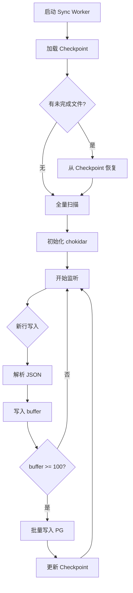

# PostgreSQL 集成 - 方案C: 后台同步程序

## 架构图

```
┌─────────────────────────────────────────────────────────────────────────────┐
│                    Claw-Hive Server                              │
│                    (只写文件，不改)                           │
└─────────────────────────────────────────────────────────┬────────────────┘
                                                      │
                    ┌───────────────────────────────┐
                    │  Event/JSONL files         │
                    │  • captures/*.jsonl         │
                    │  • sessions/**/*.jsonl       │
                    │  • events/*.jsonl           │
                    └───────────────────────────────┘
                                   │
                                   │ 文件变化
                                   ▼
                    ┌───────────────────────────────────┐
                    │       Sync Worker (Node.js)       │
                    │                                 │
                    │  ┌─────────────────────────┐   │
                    │  │ chokidar File Watcher  │   │
                    │  │ + File Reader          │   │
                    │  └─────────────────────────┘   │
                    │               │                 │
                    │               ▼                 │
                    │  ┌─────────────────────────┐   │
                    │  │ Line Parser           │   │
                    │  │ (parse JSON lines)    │   │
                    │  └─────────────────────────┘   │
                    │               │                 │
                    │               ▼                 │
                    │  ┌─────────────────────────┐   │
                    │  │ Batch Insert          │   │
                    │  │ (每100行或每5秒批量)   │   │
                    │  └─────────────────────────┘   │
                    └───────────────┬─────────────────┘
                                    │
                                    ▼
                    ┌───────────────────────────────────┐
                    │        PostgreSQL                  │
                    │  ┌─────────┐  ┌─────────────┐   │
                    │  │captures │  │  sessions  │   │
                    │  │  table  │  │   table    │   │
                    │  └─────────┘  └─────────────┘   │
                    └───────────────────────────────────┘
```

## 数据流

```
File Event                    Sync Worker Flow              PostgreSQL
─────────                  ──────────────              ──────────
                              
[新行写入]                       │
    │                          │
    └──────────────────────────▶│ parse JSON line
                                │ (batch buffer)
                                │
                                │ (100行 或 5秒)
                                │
                                └────────────────▶ INSERT bulk
                                                   ✓ committed
```

## 程序模块

```
sync-worker/
├── index.ts           # 入口
├── watcher.ts         # 文件监听
├── parser.ts          # JSON 解析
├── db.ts              # PG 写入
├── metrics.ts         # 进度指标
└── checkpoint.ts     # 断点续传
```

## 核心代码

### 1. watcher.ts

```typescript
import * as chokidar from 'chokidar';
import * as fs from 'fs';

export function createWatcher(dirs: string[], onLine: (file: string, line: any) => void) {
  const watcher = chokidar.watch(dirs, {
    persistent: true,
    ignoreInitial: false,
    awaitWriteFinish: 1000,  // 等待写入完成
  });

  // 监听新行追加
  watcher.on('change', async (path) => {
    const lastLine = await getLastLine(path);
    if (lastLine) onLine(path, JSON.parse(lastLine));
  });

  return watcher;
}

async function getLastLine(file: string): Promise<string | null> {
  const lines = await fs.promises.readFile(file, 'utf-8').then(
    f => f.split('\n').filter(Boolean).pop()
  );
  return lines || null;
}
```

### 2. db.ts

```typescript
import { Client } from 'pg';

const client = new Client({
  connectionString: process.env.DATABASE_URL,
});

await client.connect();

const BATCH_SIZE = 100;
const buffer: any[] = [];
let flushTimer: NodeJS.Timeout;

export async function queueCapture(capture: any) {
  buffer.push(capture);
  
  if (buffer.length >= BATCH_SIZE) {
    await flush();
  } else if (!flushTimer) {
    flushTimer = setTimeout(flush, 5000);
  }
}

async function flush() {
  if (buffer.length === 0) return;
  
  clearTimeout(flushTimer);
  const batch = buffer.splice(0);
  
  await client.query(`
    INSERT INTO captures 
    (agent_id, model, provider, tokens_in, tokens_out, latency_ms, request_json, response_json, cost_usd, created_at)
    VALUES ${batch.map(c => `
      ('${c.agent_id}', '${c.model}', '${c.provider}',
       ${c.tokens_in}, ${c.tokens_out}, ${c.latency_ms},
       '${JSON.stringify(c.request)}', '${JSON.stringify(c.response)}',
       ${c.cost || 0}, '${c.timestamp || new Date().toISOString()}'
    `).join(',')}
  `);
  
  console.log(`[Sync] Flushed ${batch.length} records`);
}

export async function flush() {
  // periodic checkpoint
}
```

### 3. checkpoint.ts

```typescript
// 记录已同步位置
interface Checkpoint {
  file: string;
  lastOffset: number;  // 最后同步的字节偏移
  lastLine: string;    // 最后一行内容 (防重复
}

const checkpointFile = '.sync-checkpoint.json';

export function saveCheckpoint(file: string, offset: number) {
  const cp = readCheckpoint();
  cp[file] = offset;
  fs.writeFileSync(checkpointFile, JSON.stringify(cp));
}

export function readCheckpoint(): Record<string, number> {
  try {
    return JSON.parse(fs.readFileSync(checkpointFile, 'utf-8'));
  } catch {
    return {};
  }
}
```

## 启动流程



## 监控

```typescript
// /metrics 端点
app.get('/sync/status', (req, res) => {
  res.json({
    bufferSize: buffer.length,
    lastSync: checkpoint,
    lag: Date.now() - lastEventTime,
    errors: errorCount,
  });
});
```

---

## 一句话总结

**只监听文件变化，写入 PG，不改主程序。**
